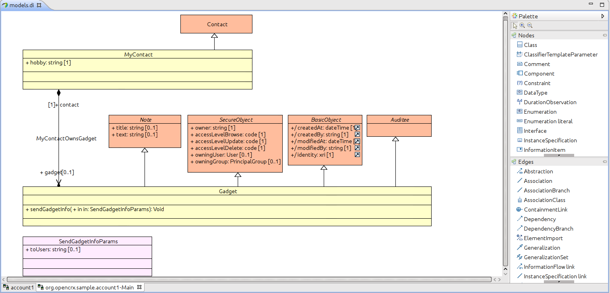

# How to create a custom project #

This guide explains how to create a custom project for _openCRX_. A custom project allows to extend the customizing delivered with the standard distribution of _openCRX_ by adding and modifying

* Headers, footers and logos
* Groovy-based controls
* Code tables
* Wizards
* Reports
* Backend extensions
* Model and database extensions
* Custom WARs

A custom project allows to separate the directory structure of the _openCRX_ distribution and the custom-specific files.

This guide assumes that the _openCRX SDK_ is installed (also see [here](Sdk/BuildFromSource.md)).

## Checkout and build the sample custom project ##

_openCRX SDK_ comes with a sample custom project.

```
git clone https://github.com/opencrx/opencrx-custom.git opencrx-custom
cd opencrx-custom
git checkout opencrx-v{version}
cd sample
gradle clean
gradle assemble
```

## Verify project structure ##
After successfully building the project the directory structure looks as shown below.


* _jre-1.8/sample/deployment-units_: custom-specific deployment units (e.g. _EAR_, _WAR_)
* _jre-1.8/sample/lib_: custom-specific _JARs_
* _sample/etc/deployment-unit_: custom web application.
* _sample/build.properties_: allows to customize project-specific properties
* _sample/build.gradle.kts_: custom-specific Gradle build file
* _sample/src/data/org.opencrx.sample_: contains the custom-specific UI extensions. You have to put the custom-specific files such for ui, codes, reports, wizards, etc. in these directories. They are added to the _WAR_. A very important file is the ./WEB-INF/web.xml which contains the configuration of all servlets.
* _sample/src/java_: custom-specific backend
* _sample/src/ear_: custom-specific deployment descriptors
* _sample/src/model_: custom-specific model extension

## Import the Eclipse projects ##
Generate the Eclipse project files as follows:

```
gradle eclipse
```

Then import the project into a new or existing _Eclipse_ workspace.

## Store ##
The _Store_ application shows how to build a stand-alone web application which uses _openCRX_ as backend. 
After running _ant all_ you will find in _jre-1.8/sample/deployment-units_ the file _opencrx-sample-store.war_. 
You can deploy this _WAR_ to any application server instance. E.g. deploy to the _webapps_ directory of your 
current _Tomcat_ instance. In order to be able to connect to your _openCRX Server_ instance, check the 
following entries  in the _./sample/src/war/opencrx-sample-store.war/WEB-INF/web.xml_:

```
<context-param>
	<param-name>url</param-name>
	<param-value>http://127.0.0.1:8080/opencrx-rest-CRX/</param-value>
</context-param>
<context-param>
	<param-name>userName</param-name>
	<param-value>admin-Standard</param-value>
</context-param>
<context-param>
	<param-name>password</param-name>
	<param-value>admin-Standard</param-value>
</context-param>
```

Adapt the parameter values according to your environment and run _ant assemble_ again after having made modifications.

The _Store_ application comes with some sample data which you can load with the standard _openCRX GUI_:

* Login as segment administrator (e.g. _admin-Standard_).
* On the user's home select _File > Import_ and import the file _sample/src/war/opencrx-sample-store.war/data/uoms.xml_.
* Next import the file _sample/src/war/opencrx-sample-store.war/data/products.xml_.
* Now launch the _Store_ application with _http://localhost:8080/opencrx-sample-store/Store.jsp_. Adapt host and
  port according to your environment.
  
You then get the start screen as shown below:


If you want to build your own web application and use _openCRX_ as backend it should be straight-forward 
to use the _Store_ application as template and adapt it to your use-cases and _GUI_ frameworks.

## Model extension ##
_openCRX_ follows a _Model Driven Software Development_ (MDSD) approach. Hence, many _openCRX_ artifacts (_API_,
_XML_ schemas, persistence mappings and classes, etc.) are the derived from the model. I.e. they are generated 
at build-time by model mapping tools provided by the underlying _MDA_ framework 
_openMDX_ (see [here](http://www.opencrx.org) for more information). As a consequence, the _openCRX Core_ model 
must be extended in case new attributes or operations are to be added to the _API_, GUI, or database. In order 
to get a basic understanding of the _MDSD_ approach it is a good idea to read the following documents:

* [Introduction to Modeling with openMDX](https://github.com/openmdx/openmdx-documentation/blob/master/Modeling/README.md) 
* [openMDX Workshop Project](https://github.com/openmdx/openmdx-documentation/blob/master/Sdk/Workshop.md)
* The source files of the _openCRX Sample_ project

The _sample_ project comes with a simple model extension. In _Eclipse_ open the _Papyrus_ model by opening
_openCRX 4 Custom ~ Sample (Papyrus)/models.di_. Then select the diagram named _org.opencrx.sample.account1-Main_. It 
should look as shown below:



The _sample_ project extends the _openCRX Core_ model by the following elements:

* Class _org:opencrx:sample:account1:MyContact_: _MyContact_ extends the class _org:opencrx:kernel:account1:Contact_ 
  from _openCRX/Core_. It adds the  and adds the multi-valued attribute _hobby_.
* Class _org:opencrx:sample:account1:Gadget_: _Gadget_ extends the classes _org:opencrx:kernel:base:Note_, 
  _org:opencrx:kernel:base:SecureObject_, _org:opencrx:kernel:base:Auditee_, and _org:openmdx:base:BasicObject_. 
  All attributes are inherited.
* Association _org:opencrx:sample:account1:MyContactOwnsGadget_: the composite association allows to add 0..n gadgets
  to a _MyContact_. 

## Next steps ##
* If you want to rename the project _sample_ by your own name, e.g. _myname_ then you have to adapt _build.xml_, _build.properties_ and the directory name containing the data files in _src/data_
* If you want to learn more about UI customizing then see [here](http://www.opencrx.org/documents.htm) for more information

## Congratulations ##
You have successfully created your first _openCRX_ custom project.
